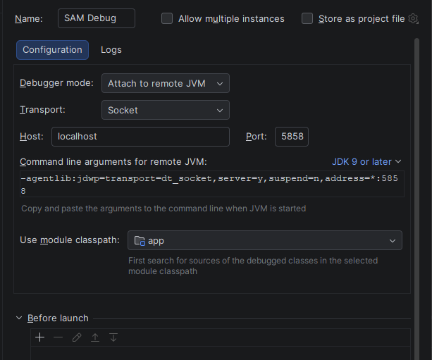

## Para rodar local precisa ter instalado o sam da aws
[doc sam aws](https://docs.aws.amazon.com/serverless-application-model/latest/developerguide/install-sam-cli.html)

### o arquivo responsavel por executar o sam é o template.yaml

## Execução

1- suba o banco de dados

````shell
docker compose up -f docker/docker-compose.yml up -d
````

2- faça o build

````shell
 sam build
````

3- Execute o sam

````shell
sam local start-api --add-host host.docker.internal:host-gateway
````

4- curl para gerar token

````shell
curl -X POST http://localhost:3000/auth -H "Content-Type: application/json" -d "{\"document\":\"529.982.247-25\"}"
````
---

# Modo debug

1- start do sam
````shell
 sam local start-api --debug-port 5858 --warm-containers EAGER --add-host host.docker.internal:host-gateway
````

2- faça um curl 

````shell
 curl -X POST http://localhost:3000/auth -H "Content-Type: application/json" -d "{\"document\":\"999.999.999-99\"}"
````

3- configure intellij para remote debug conforme imagem



````shell
Name: SAM Debug
Host: localhost
Port: 5858
````

